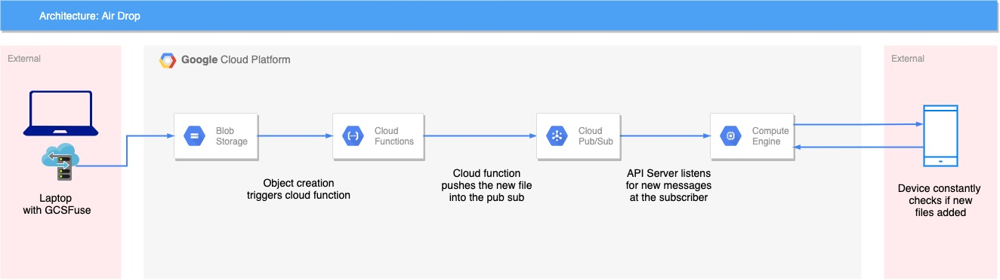

# Air Drop Backend

This repository contains all the code required to setup the cloud function and the API server.

## Infrastructure



The infrastructure has the following components:
1. Google Cloud Storage Bucket.
2. GCS Fuse.
3. Cloud Function.
4. Pub/Sub.
5. API Server.
6. Android App.

## Components

### Google Cloud Storage Bucket

The storage bucket is needed to, well, store all the files. 

It can be created either from the command line or from the google cloud console.

GCS Fuse would mount this storage bucket onto the local filesystem.

### GCS Fuse

GCS Fuse is a tool developed to mount a google cloud storage bucket as an external disk in your local file system.

This is a necessary component in the system, as with this we would be creating a folder which would serve as a sink.

Any file added to this folder automatically would be automatically uploaded to the GCS Bucket, and thus be available to download on the mobile device.

Steps for installation and mounting can be found [here](https://github.com/GoogleCloudPlatform/gcsfuse).

### Cloud Function

The cloud function is triggered when an object is uploaded into the bucket.

The cloud function has one purpose: Feed the newly uploaded file to the pub/sub. 

It extracts the filename from the event object, and pushes the same into the pub/sub.

```
file = event
GCS_BUCKET = file['bucket']
FILENAME = file['name']
GCP_PROJECT = os.environ['GCP_PROJECT']
TOPIC = os.environ['push_topic']
data = {
    'filepath': "gs://" + GCS_BUCKET + "/" + FILENAME,
    'filename': FILENAME,
    'bucket': GCS_BUCKET
}

publisher = pubsub_v1.PublisherClient()
topic_path = publisher.topic_path(GCP_PROJECT, TOPIC)

publisher.publish(topic_path, json.dumps(data).encode('utf-8'))
print("Published data: " + json.dumps(data))
```

The complete file can be found [here](./topic_push_cf.py).

### Pub/Sub

Pub/Sub or Publisher/Subscriber is a powerful message queue in the Google Cloud environment.

As the name suggests, it needs to have a publisher and a subscriber, thus there are two components in the Pub/Sub:
1. Topic.
2. Subscription.

A topic is a queue into which you push the data. A subscription is a piece of code that consumes the messages in the topic.

A subscription is attached to a specific topic.

In general there are two types of subscriptions:
1. Push.
2. Pull.

In the Push mechanism, you specify an endpoint, and Google will trigger that endpoint and pass the payload from the topic.

In the Pull mechanism, the code needs to constantly listen and check if there are any new messages in the topic.

For our use-case, we would be using a Pull subscription. As there is an API which checks if there are any messages in the topic.

### API Server

We have a small flask server containing three APIs. 

Let's go over the APIs.

#### APIs

##### GET /api/pull

On invoking this API, we get a list of new files uploaded into the bucket.

The API checks if there are any new messages published in the Pub/Sub topic and return the new messages.

If there are any new messages, it downloads the files from the storage bucket and keeps it in the server.

##### GET /api/download

This API is used to download a file from the server.

It accepts a query parameter called `file`.

```/api/download?file=filename```

This API is used in the Android App to directly download the file.

##### GET /api/health

This is a simple health check API. It returns a 200 OK by default, until and unless the API server is stopped.

To understand more about the actual code, read [this](./webserver/README.md).

### Android App

The App has two purposes:
1. Constantly hit the `/api/pull` API to check if there are any new files uploaded.
2. If new files are added, download them using the `/api/download` API.

To understand more about the Android App check [this repository](https://github.com/srinibasmisra97/Air-Drop-Android-App).